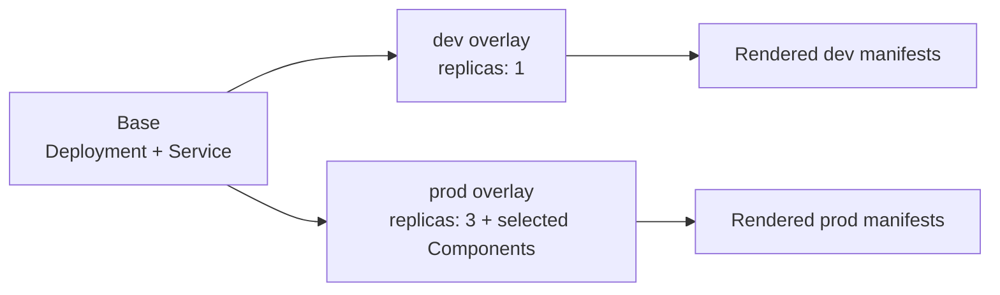

# Crawl: build the app

This guide uses a small NGINX `catalog` app. The base owns its Deployment and Service; overlays set environment-specific replicas. Later lessons add two optional Components: pod security settings and a NetworkPolicy.



## What you need

- Git
- `kubectl` with Kustomize support
- An Argo CD installation for the final lesson

Use Kustomize **v3.7.0 or later** for Components. Selecting Components directly in an Argo CD `Application` requires Argo CD **v2.10.0 or later**.

All runnable files are under [`../examples`](../examples/). The NetworkPolicy example assumes your cluster's CNI enforces NetworkPolicy resources.

Start with the base and a plain development overlay. This overlay has no Components enabled.

```sh
kubectl kustomize doc/examples/apps/catalog/overlays/dev
```

Read the output: it contains a Deployment with one replica and a Service. `doc/examples/apps/catalog/base` owns shared resources; `overlays/dev` composes the base and sets an environment-specific replica count. `kubectl kustomize` renders only; Argo CD performs this same render from the directory named by the Application's `spec.source.path`.

Try the production overlay too:

```sh
kubectl kustomize doc/examples/apps/catalog/overlays/prod
```

The production overlay sets three replicas and also selects Components, which the next lesson explains. For now, focus on how both overlays reuse the same base and set an environment-specific replica count. An overlay is a complete build target: it gathers the base and all chosen customizations into one deployable variant.

---

[Next: Walk →](../walk/README.md)
