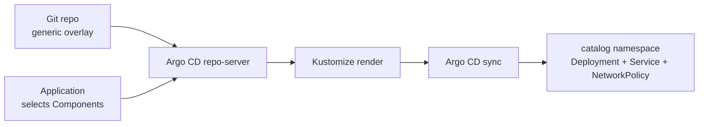

# Run: let Argo CD select Components

You can also keep an overlay generic and select Components in the Argo CD `Application`. This is useful when component selection belongs with the app registration or platform configuration. It requires Argo CD v2.10.0 or later, and the component paths are relative to `spec.source.path`.

This is the relevant part of the example Application:

```yaml
source:
  path: doc/examples/apps/catalog/overlays/argocd
  kustomize:
    components:
      - ../../../../components/pod-security
      - ../../../../components/network-policy
```

Argo CD adds these component paths while rendering the selected source path. The paths are relative to `source.path`, so they resolve to the shared Component directories under `doc/examples/components/`. The generic overlay stays reusable; the Application chooses this deployment's optional capabilities.



The example Application points at `doc/examples/apps/catalog/overlays/argocd` and opts into both Components in [`catalog-prod.yaml`](../examples/argocd/catalog-prod.yaml). The manifest is configured for this repository; adjust `repoURL` if you forked it. Apply it to a cluster where Argo CD is installed:

```sh
kubectl apply -n argocd -f doc/examples/argocd/catalog-prod.yaml
argocd app get catalog-prod
argocd app diff catalog-prod
argocd app sync catalog-prod
argocd app wait catalog-prod --sync --health
kubectl get application catalog-prod -n argocd
kubectl get deployment,service,networkpolicy -n catalog
```

The Application's destination namespace is `catalog`; `CreateNamespace=true` lets Argo CD create it. The target revision is `main`. Sync is manual in this example so you can review the diff before applying it.

Success looks like `Synced` and `Healthy` for the Application, a `catalog` Deployment with all three replicas ready, and the `catalog-ingress` NetworkPolicy. The Service is named `catalog` and serves port 80.

`kubectl kustomize doc/examples/apps/catalog/overlays/argocd` renders the generic overlay alone; it cannot see the Application's `spec.source.kustomize.components`. For the exact Argo CD result, inspect the Application's rendered manifests or run `argocd app diff`. If you want local builds and Argo CD to share one obvious source of component selection, declare `components` in the overlay as the production overlay does.

## Further reading

- [Kustomize Components example](https://github.com/kubernetes-sigs/kustomize/blob/master/examples/components.md)
- [Argo CD: Kustomize](https://argo-cd.readthedocs.io/en/stable/user-guide/kustomize/)
- [Kubernetes: Kustomize](https://kubernetes.io/docs/tasks/manage-kubernetes-objects/kustomization/)

---

[← Walk](../walk/README.md)
